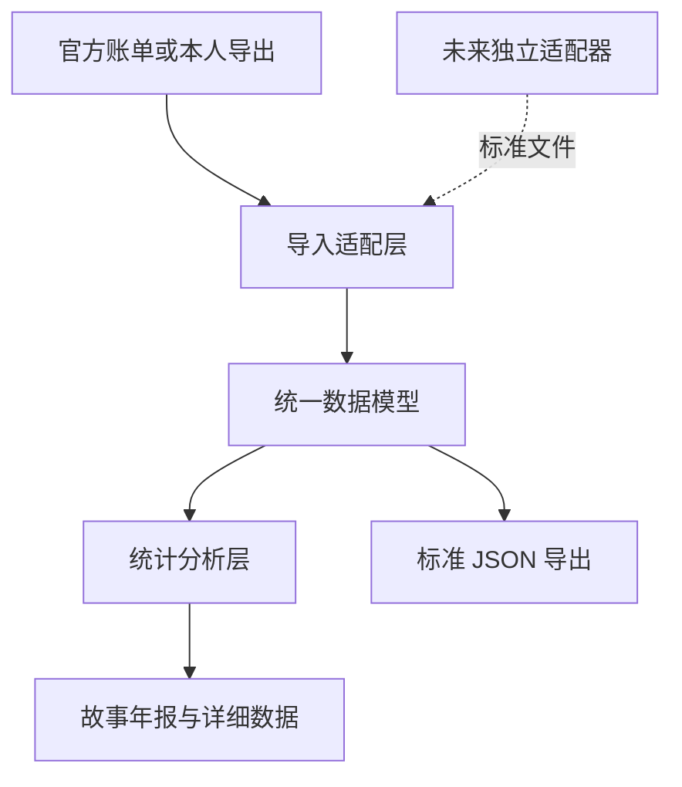

# 架构：稳定主程序 + 可替换数据适配器

## 设计目标

微信年轮要在微信版本变化、不同操作系统和公开发行约束下仍然可维护。因此把“得到数据”和“分析数据”分开：V0.2.1 主程序只处理用户主动选择的结构化文件。

## 分层

| 层 | 当前职责 | 不承担的职责 |
|---|---|---|
| 桌面壳 | `app://` 隔离窗口、权限拒绝、受信外链、安全熔断 | 微信登录、进程注入、任意本地导航 |
| 导入适配层 | 后台线程解析、多文件/文件夹选择、CSV/JSON 字段映射、嵌套展开、诊断与去重 | 密钥提取、WCDB 解密 |
| 统一模型 | messages/payments/moments 与可信度 | 保存到云端 |
| 分析层 | 年份过滤、类型/时间/金额/覆盖统计 | 推测缺失数据、语义监控 |
| 展示层 | 故事年报、详细面板、隐私分享图 | 展示未导入的伪数字 |
| 独立适配器（未来） | 在明确授权下把本人数据输出成标准文件 | 成为主程序启动前提 |

## 从 EchoTrace 借鉴的经验

- 数据库/导入服务、分析服务、导出服务分开。
- 复杂分析不堵塞基础导出能力。
- 本地缓存和批处理是大数据量阶段的合理升级方向。
- 年报是分析结果的一个消费者，而不是解析器本身。

## 从 WeFlow 吸取的经验

- 取密钥、解密和特定微信版本绑定会形成单点失效。
- 法律、平台安全策略或微信更新都可能让这层突然不可发布。
- UI 壳存在不代表数据链路可用，所以产品必须展示数据来源和覆盖状态。

## 微信年轮的改进

1. 定义带 `schemaVersion` 的标准 JSON，让适配器、分析器和其他项目可以低耦合协作。
2. 默认导入优先；安全敏感能力不进入 Electron 渲染进程。
3. 未来适配器必须是独立进程/独立仓库，可被完全移除，失败时仍能手动导入。
4. macOS 适配器不得以关闭 SIP 作为面向普通用户的前提。
5. 每项统计携带覆盖状态，缺失就是缺失，不用 0 或估算填空。
6. 每个导入文件携带识别数与跳过数；标准 JSON 明确记录年份范围，账单完整性按声明日期而不是“是否有数据”判断。
